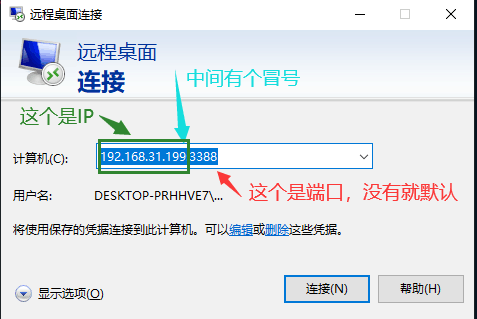
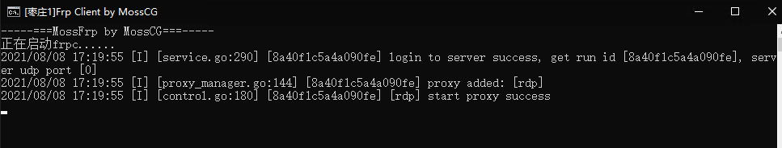

# 远程桌面(RDP) 穿透指南

!> 穿透远程桌面前务必阅读 [安全指南](/bestpractice/security)，确保您的系统已经 **安装了最新的补丁** 并且设置了 **强登录密码**  
进行内网穿透等于 **绕过所有防火墙** 将您的计算机直接暴露于公网中，您需要自行承担由此带来的风险

## 如果看不懂文字版可以看一分钟视频教程

*注: 视频教程跳过了很多东西，不推荐阅读理解能力没有问题的用户观看*

<b style="font-size: 20px">Windows 7 (点击展开)</b>

[Windows 7 RDP 视频](_videos/rdp-win7.mp4 ':include :type=video')

 

<b style="font-size: 20px">Windows 10 (点击展开)</b>

[Windows 10 RDP 视频](_videos/rdp-win10.mp4 ':include :type=video')

## 默认端口

- RDP: 3389
- VNC: 您来错地方了，这篇教程和 VNC 没关系

## 前置需求

如果您还没有启用远程桌面的话，请遵循 [微软的说明](https://support.microsoft.com/zh-cn/windows/%E5%A6%82%E4%BD%95%E4%BD%BF%E7%94%A8%E8%BF%9C%E7%A8%8B%E6%A1%8C%E9%9D%A2-5fe128d5-8fb1-7a23-3b8a-41e636865e8c ':target=_blank') 启用远程桌面，然后继续下面的步骤。

## 确认目标服务

?> 如果是穿透到本地计算机 (运行 frpc 的电脑)，一般可以跳过这一节，使用 IP 为 `127.0.0.1`，端口为 `3389` 即可

进行穿透前请先确认要穿透到的服务能被正常访问到，用 `远程桌面连接` 在 **运行 frpc 的电脑上** 访问一下您的服务，确保远程桌面可以正常连接后，参考下图找到您的目标 IP 和端口:

上图中，我们要穿透的 IP 是 `192.168.31.199`，端口是 `3388`。

## 创建隧道

选择隧道类型为 `TCP` 后直接填写刚才获取到的 `IP` 和 `端口` 即可。

## 启动隧道

启动隧道，获取穿透后的连接方式并尝试连接。

通常情况下，看见红框内的字链接就成功了。

