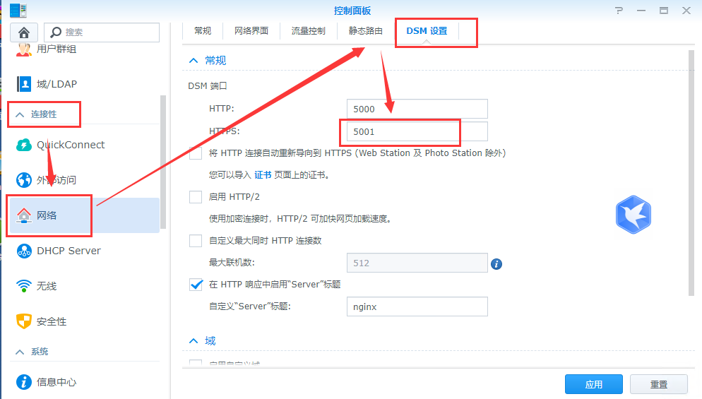
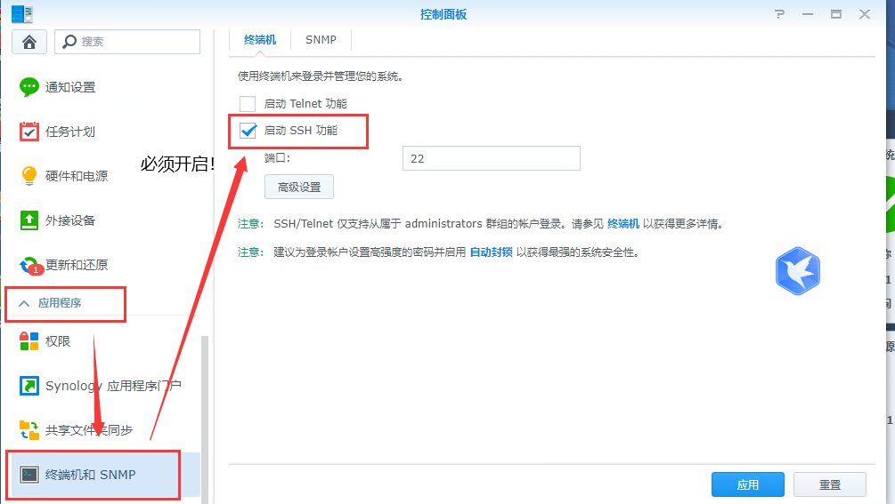
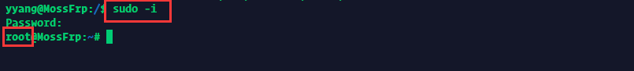
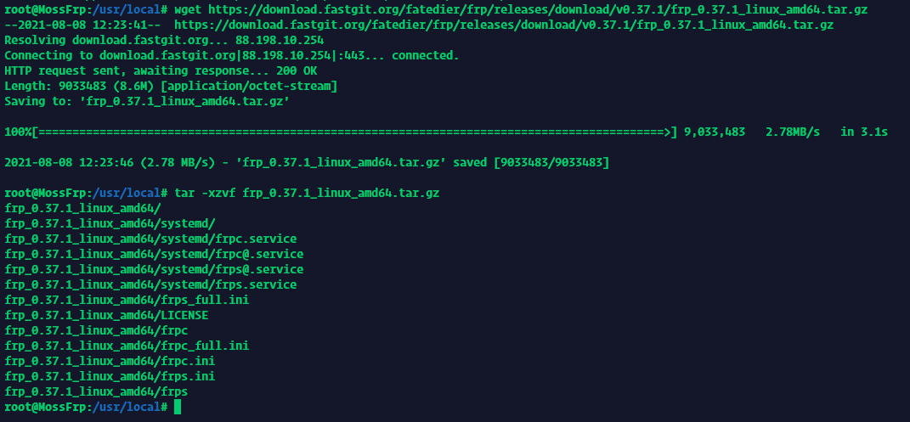
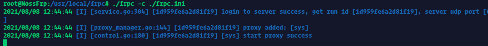
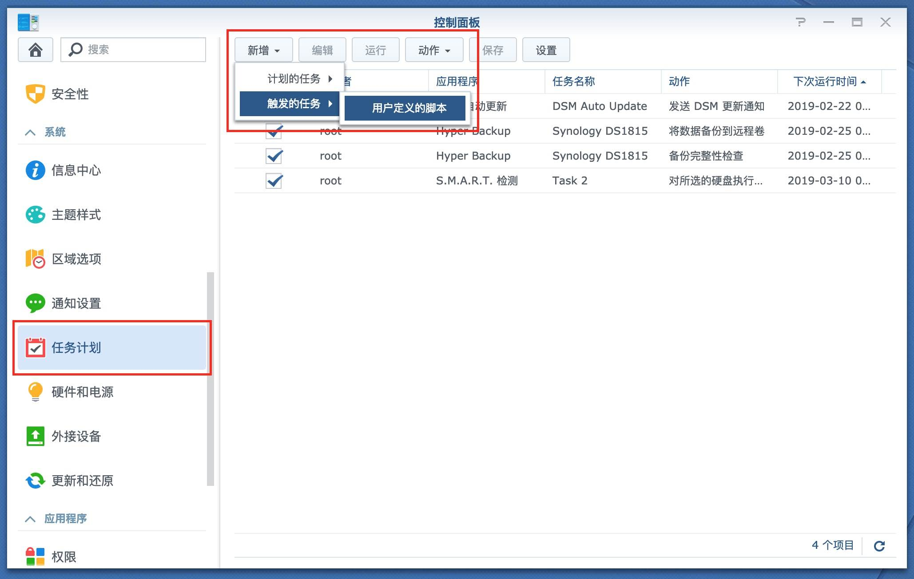
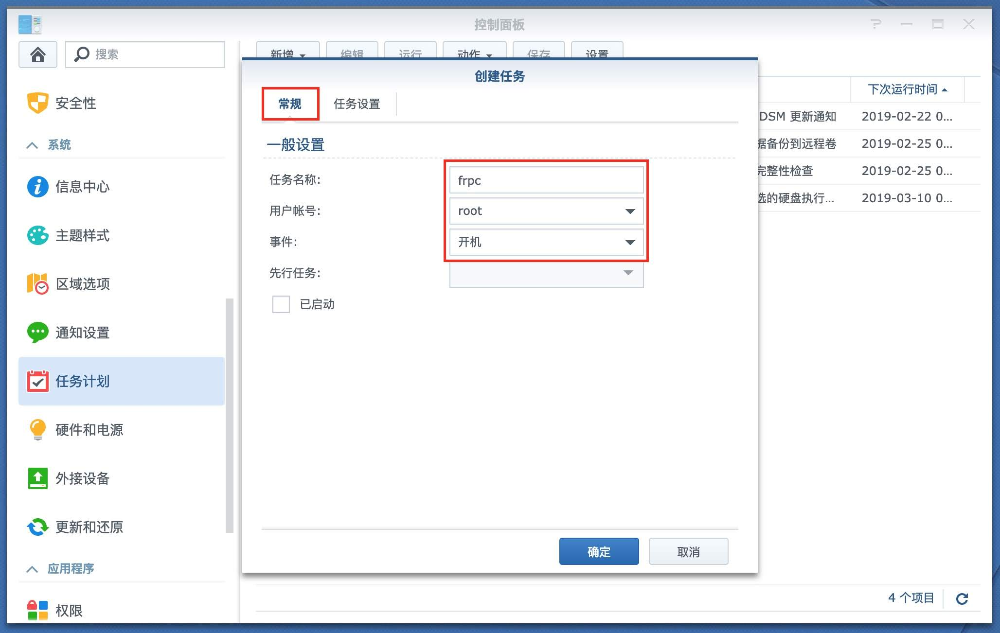
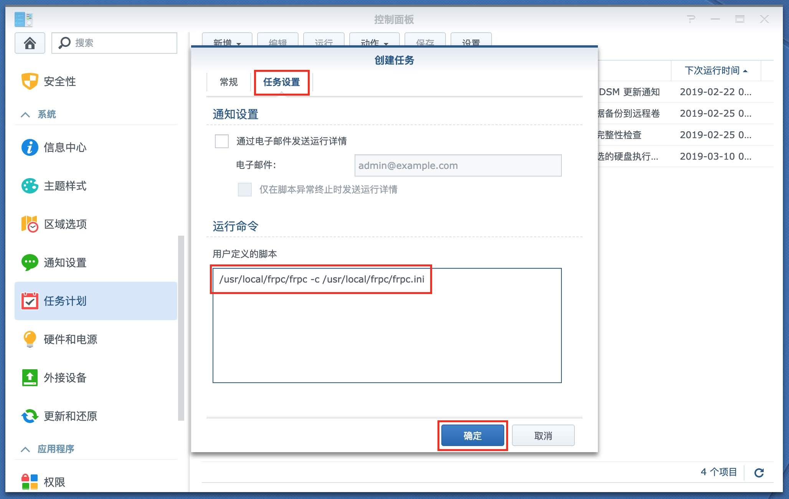
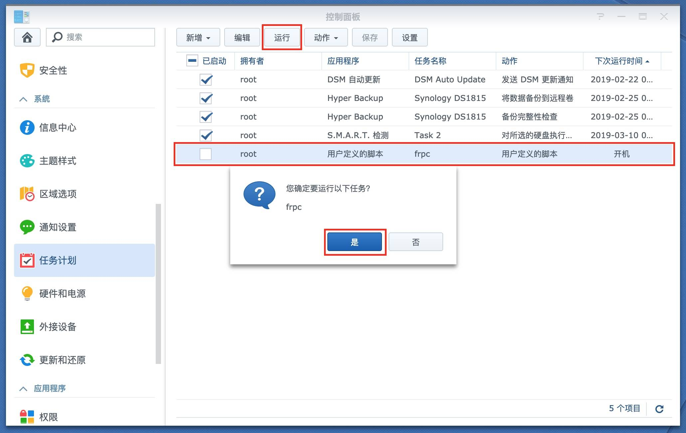
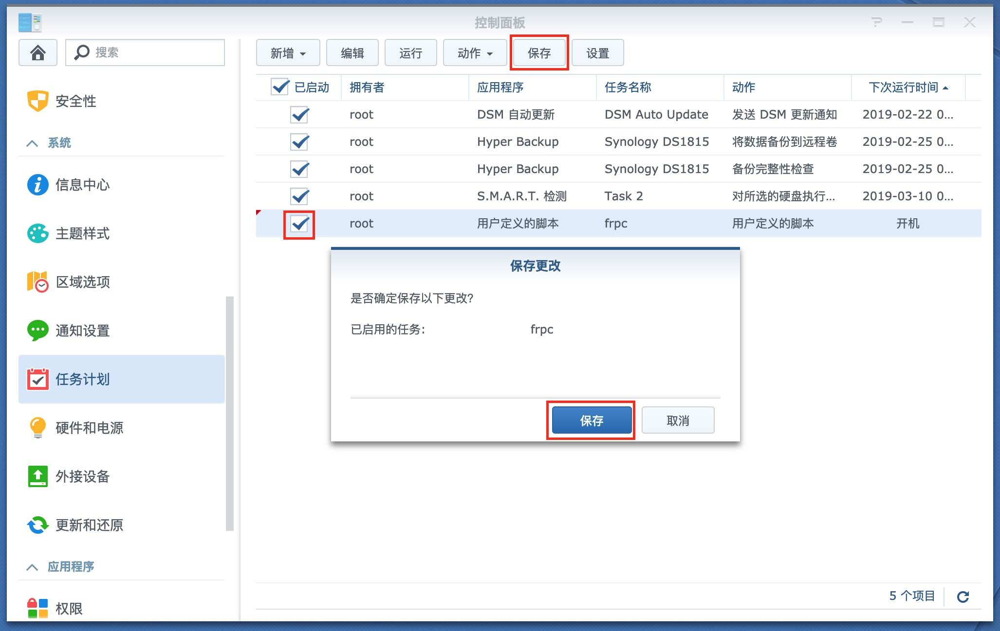

# 群晖(Synology) NAS 穿透指南

群晖 NAS 通常可以 **直接在系统上安装** 以保证运维原教旨主义者，和电子垃圾玩家

## 使用准备

### 配置 DSM 面板

登录 DSM 面板，找到 `连接性->网络->DSM 设置->DSM 端口->HTTPS`，记下这里的端口，后面创建隧道时需要用到



同样在面板设置里找到 `应用程序->终端机和 SNMP`，确保 SSH 功能已启用并记下这里的 SSH 端口



## 部署穿透服务

### 安装 frpc

通过上面提到的 SSH 端口和 DSM 面板的账号、密码登入到 NAS，如果您不知道如何操作请自行百度
我这边采用Termius给大家做演示
注意这里需要采用 `sudo -i` 切换到 `root` 账户，不能使用 `su` 命令，提示输入密码时请输入 DSM 登录密码
当你看见root字符的时候就代表你成功了



进入安装目录(本文以/usr/local/为例),创建一个名为frpc的文件夹

```bash
cd /usr/local 
mkdir frps
```


下载最新版的Frpc,并解压他(她 它 Ta)

```bash
wget https://download.fastgit.org/fatedier/frp/releases/download/v0.37.1/frp_0.37.1_linux_amd64.tar.gz
tar -xzvf frp_0.37.1_linux_amd64.tar.gz
```



拷贝下载的客户端文件到frpc文件夹

```bash
cd frp_0.37.1_linux_amd64      
cp frpc frpc_full.ini frpc.ini ../frpc
```


删除无用文件和文件夹

```bash
cd /usr/local
rm -rf frp_0.37.1_linux_amd64 frp_0.37.1_linux_amd64.tar.gz
```


### 配置 frpc

!> 配置服务文件 和 测试服务 部分的教程是为 DSM5/6 准备的，如果您在使用 DSM7那我也没办法

编辑frpc.ini文件

```bash
cd frpc
vi frpc.ini
```
修改参照

```bash
[common]
server_addr = cz1.mossfrp.cn   // 节点提供的服务器地址
server_port = 4000             // 节点提供的端口
token = token      // 墨守提供的token

[nas]                          // 任意命名,不可重复
type = tcp                     // tcp协议
local_ip = 127.0.0.1           //默认无需修改,如果需反代到局域网内其他NAS或者服务器,应填写相应的内网IP,例如192.168.1.2
local_port = 5000              // 本地端口
remote_port = 40001            // 在墨守给你的端口范围内选择
```

### 启动frpc

启动frpc命令

```bash
./frpc -c ./frpc.ini
```



保持后台运行frpc命令

```bash
nohup ./frpc -c ./frpc.ini &
```

## 设置群晖NAS重启开机自动运行frpc

登录 DSM ，找到 `控制面板->任务计划->新增->触发的任务->用户自定义脚本`



点击常规，随便填写一个任务名称，用户账号和事件保持默认



再点击任务设置，用户自定义脚本，填写你的frpc安装路径，点击确定

```bash
/usr/local/frpc/frpc -c /usr/local/frpc/frpc.ini
```



选中新增的脚本，运行



勾选新增的脚本，保存




