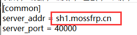

# 常见问题: 其他

## 创建隧道时提示 您选择的端口不可用 (被其他人占用)

端口被别人占用了，您没有抢过来使用的特权。请换一个端口或者换一个节点试试。我们建议留空远程端口让系统自动生成。

## 创建隧道时提示 您选择的端口不可用 (超出允许端口范围)

请点击远程端口旁边的 **查看规则** 查看节点允许使用的端口。

## 我可以使用超出可用端口范围 (如 10240 以下) 的端口吗

不能，开放这些端口可能造成安全隐患或加重服务滥用。

## 但是我就是想用 / 我的 XXX 服务一定要用 XXXX 端口，能不能开放一下

您没有使用这些端口的特权，建议您尝试穿透 VPN 或者找其他服务商。

## 有没有全端口映射

没有。

## 隧道或软件可以重复开启吗

一条隧道只能对应一个运行中的 frpc 进程。“重复开启” 的定义较为模糊，请参考下表中的说明：

| 具体情况 | 可行性 | 说明 |
| --- | --- | --- |
| 一台电脑开启多个 frpc，连接 **ID 相同的** 隧道 | 不可以 | 如果这么做，节点就不知道应该把请求转发给哪个 frpc 了 因此隧道无法正常启动，会提示 `port already used` 等错误信息 |
| 在电脑 A 上开启一条和电脑 B 上 **ID 相同的** 隧道 | 不可以 | 参考上面 ↑ |
| 在一台电脑上开启多条 **ID 不同的** 隧道 | 可以 | 这是很常见的场景 |
| 在多台电脑的 **启动器** 上 **登录同一个账号** | 可以 | 我们不限制启动器的登录设备数量 |

## 一个 frpc 可以连接多条隧道吗

?> 请注意区别 **进程** 和 **文件**。如果您无法理解这两个概念，可以参考 [百度百科: 进程](https://baike.baidu.com/item/%E8%BF%9B%E7%A8%8B/382503 ':target=_blank')、[百度百科: 计算机文件](https://baike.baidu.com/item/%E8%AE%A1%E7%AE%97%E6%9C%BA%E6%96%87%E4%BB%B6 ':target=_blank')

一个 frpc 进程只能连接一个 **节点**，这就是说：

- 如果这几条隧道不在同一个节点，不能，必须开启多个 frpc 进程
- 启动器会自动管理 frpc 进程并且总是确保一个 frpc 连接一条隧道，因此启动器开启的 frpc 无法连接多条隧道

## 如何设置解析

- 请自行查看您域名解析提供商的帮助文档，并设置 `CNAME` 记录到节点域名。

  节点域名查看方式：

  

  红色方框框住的部分即是节点域名。

## 游戏连不上的解决办法

- 部分游戏（如 MCPE）需要本地端口与远程端口相同才可以连接。
- 检查隧道启动状态。
- 检查游戏服务端是否开启。
- 请检查端口是否配置正确。
- 请检查游戏服务端配置是否正确。

## 哪个节点好用

节点速度受以下因素影响：

- 该节点的使用人数
- 节点到客户端的物理距离
- 节点到客户端的网络状况
- 客户端、节点的网络环境差异
- 国家政策
- 部分不可抗力因素
- 某些“带佬”恶意攻击

> 送某些人一句话：如果有 10% 的利润，它就保证到处被使用；有 20% 的利润，它就活跃起来；有 50%的利润,它就铤而走险；为了 100% 的利润，它就敢践踏一切人间法律；有 300% 的利润，它就敢犯任何罪行，甚至绞首的危险。

综上所述，我们无法告知您哪个节点最好用，另外也请您不要相信网络上所谓 `XX节点最好用` 的言论，建议您自己进行测试。

**请您牢记：在没有亲身验证之前，任何关于 `XX节点最好用` 的言论都是不可靠的。**
