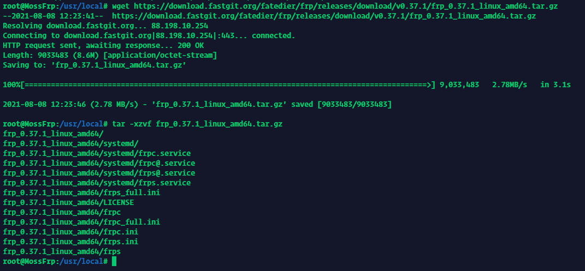
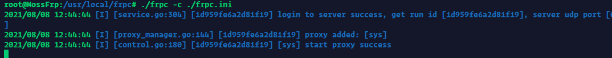

# Linux 系统使用 frpc

<!--
TODO: Update script
如果您符合以下几种情况：
+ 对自己的技术没有信心
+ 不知道该下载什么版本
+ 不会写 systemd 服务

请使用 **一键安装脚本（由 [@renbaoshuo](https://baoshuo.ren) 提供）**：`sudo bash <(curl -Ls getfrp.sh)` （需要 root 权限）
-->

## 注意

本文档中给出的命令大多需要 `root` 权限才能运行，请确保您现在已经处于有 `root` 权限的环境下。

如果您现在没有切换到 `root` 账户下，那么请使用 `su` 或者 `sudo -i` 命令来进行切换。

## 确认系统架构

下载 frpc 前，请先确认您的系统架构。执行下面的命令，根据输出结果查表：

```bash
uname -m
```

| 架构 | 输出结果 |
| --- | --- |
| i386 | `i386`, `i686` |
| amd64 | `x86_64` |
| armv6 | `arm` |
| armv7 | `armv7l` |
| arm64 | `aarch64`, `armv8l` |
| _mips*_ | `mips` |
| _mips64*_ | `mips64` |
| 不支持 | `alpha`, `arc`, `blackfin`, `c6x`, `cris`, `frv`, `h8300`, `hexagon`, `ia64`, `m32r`, `m68k`, `metag`, `microblaze`, `mn10300`, `nios2`, `openrisc`, `parisc`, `parisc64`, `ppc`, `ppcle`, `ppc64`, `ppc64le`, `s390`, `s390x`, `score`, `sh`, `sh64`, `sparc`, `sparc64`, `tile`, `unicore32`, `xtensa` |

?> 如果您的架构显示为 `armv7l`，但在下载对应程序后无法运行，提示 `Illegal instruction` 的话，请下载 `arm_garbage` 版本重试

?> 如果您的架构为 `mips` 或 `mips64`，还需要使用下面的命令来确定系统的字节序  
其他架构请直接跳到 [安装 frpc](#install-frpc) 一节

```bash
# 一般来说只需要使用这条命令:
echo -n I | hexdump -o | awk '{print substr($2,6,1); exit}'

# 如果上面的命令报错，请尝试这条:
echo -n I | od -to2 | awk '{print substr($2,6,1); exit}'
```

| 下载文件 | 输出结果 |
| --- | --- |
| mips / mips64 | `0` |
| mipsle / mips64le | `1` |

### 安装 frpc :id=install-frpc

在下方找到 frpc 的各种下载地址和您的架构标志，复制右边绿色的下载地址： :

| 文件名 | 下载链接 |
| --- | --- |
| frp_0.37.1_linux_386.tar.gz| https://download.fastgit.org/fatedier/frp/releases/download/v0.37.1/frp_0.37.1_linux_386.tar.gz |
| frp_0.37.1_linux_amd64.tar.gz| https://download.fastgit.org/fatedier/frp/releases/download/v0.37.1/frp_0.37.1_linux_amd64.tar.gz |
| frp_0.37.1_linux_arm.tar.gz| https://download.fastgit.org/fatedier/frp/releases/download/v0.37.1/frp_0.37.1_linux_arm.tar.gz |
| frp_0.37.1_linux_arm64.tar.gz| https://download.fastgit.org/fatedier/frp/releases/download/v0.37.1/frp_0.37.1_linux_arm64.tar.gz |
| frp_0.37.1_linux_mips.tar.gz| https://download.fastgit.org/fatedier/frp/releases/download/v0.37.1/frp_0.37.1_linux_mips.tar.gz |
| frp_0.37.1_linux_mips64.tar.gz| https://download.fastgit.org/fatedier/frp/releases/download/v0.37.1/frp_0.37.1_linux_mips64.tar.gz |
| frp_0.37.1_linux_mips64le.tar.gz| https://download.fastgit.org/fatedier/frp/releases/download/v0.37.1/frp_0.37.1_linux_mips64le.tar.gz |
| frp_0.37.1_linux_mipsle.tar.gz| https://download.fastgit.org/fatedier/frp/releases/download/v0.37.1/frp_0.37.1_linux_mipsle.tar.gz |

使用下面的命令进入 `/usr/local/bin` 目录并下载文件：

```bash
cd /usr/local/

# 一般来说只需要使用这条命令:
wget -O frpc <下载地址>

# 如果上面的命令报错，请尝试这条:
curl -Lo frpc <下载地址>
```


然后设置权限并校验文件是否有损坏：

```bash
chmod 755 frpc
ls -ls frpc
md5sum frpc
```

创建一个名为frpc的文件夹，并解压她

```bash
mkdir frps
tar -xzvf frp_0.37.1_linux_xxx.tar.gz
```




拷贝下载的客户端文件到frpc文件夹

```bash
cd frp_0.37.1_linux_xxx
cp frpc frpc_full.ini frpc.ini ../frpc
```


删除无用文件和文件夹

```bash
cd /usr/local
rm -rf frp_0.37.1_linux_xxx frp_0.37.1_linux_xxx.tar.gz
```


### 配置 frpc

!> 配置服务文件 和 测试服务 部分的教程是为 DSM5/6 准备的，如果您在使用 DSM7那我也没办法

编辑frpc.ini文件

```bash
cd frpc
vi frpc.ini
```

修改参照

```bash
[common]
server_addr = cz1.mossfrp.cn   // 节点提供的服务器地址
server_port = 4000             // 节点提供的端口
token = token      // 墨守提供的token

[nas]                          // 任意命名,不可重复
type = tcp                     // tcp协议
local_ip = 127.0.0.1           //默认无需修改,如果需反代到局域网内其他NAS或者服务器,应填写相应的内网IP,例如192.168.1.2
local_port = 5000              // 本地端口
remote_port = 40001            // 在墨守给你的端口范围内选择
```

### 启动frpc

启动frpc命令

```bash
./frpc -c ./frpc.ini
```



### 配置开机自启

如果您想让 frpc 在开机时自启或在后台运行，就需要将 frpc 注册为系统服务。

!> 由于文档维护者不了解 Upstart 、Systemd和 SysV-Init 的传参模式，本文档暂不提供这三种初始化系统的配置指南  
如果您熟悉这些初始化系统并且愿意为本文档作出贡献，欢迎开启 PR 完善相关文档（[GitHub 仓库](https://github.com/MossFrp/MossFrpWiki)）

首先，您要搞清楚您的 Linux 系统使用的 ***初始化系统*** 是什么，常见的初始化系统：

- Systemd
- Upstart
- SysV-Init
