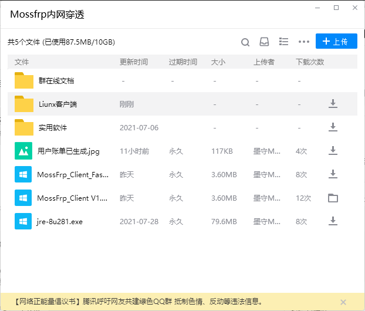
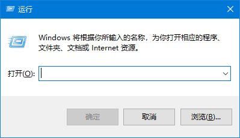
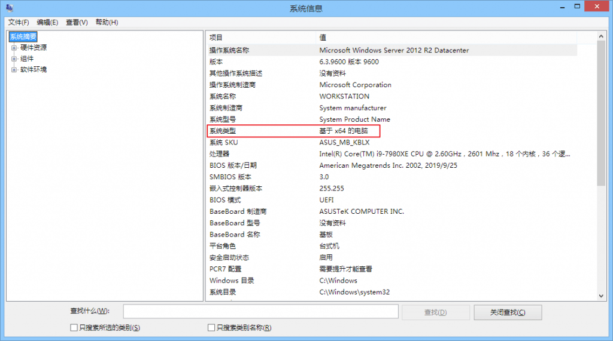
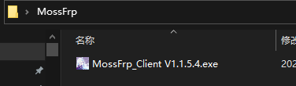
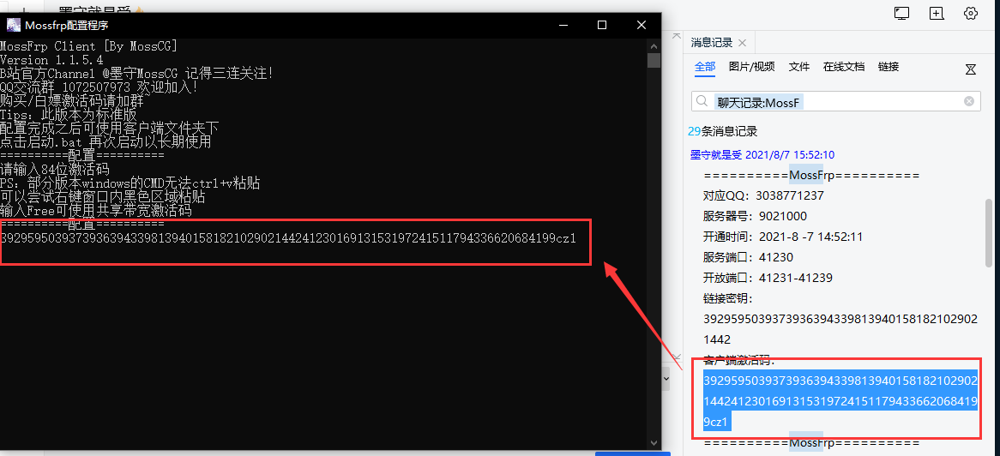
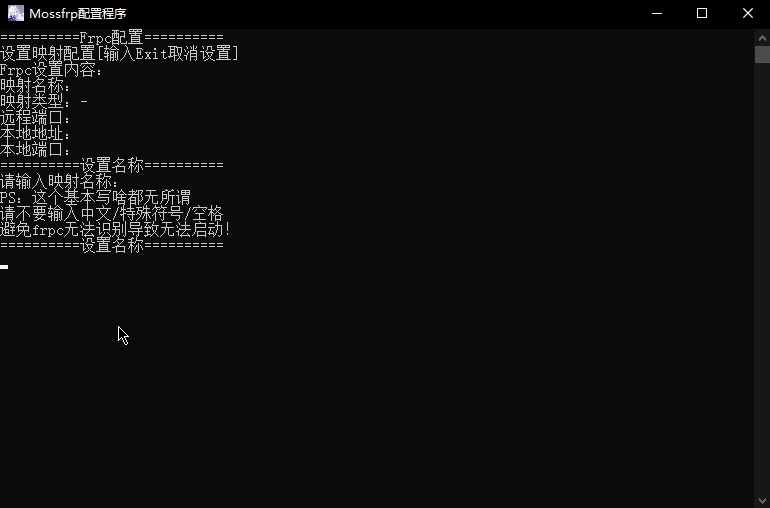

# Windows 系统使用 frpc

!> 我们推荐在 Windows 系统上直接使用 frpc

### 下载 frpc

登录QQ群，在文件夹找到MossFrp_Client



根据您的系统架构选择一个合适的版本下载
 - MossFrp_Client V x.x.x 
 - MossFrp_Client_Fastv V x.x.x
 - 暂不支持 arm 架构的 Windows 系统

 ```关于Fastv和标准版的区别
Fastv（后缀有Fastv的客户端）：
绿色版本，配置什么的更为快捷，使用后关闭会移除临时文件，达到运行不留痕迹，但是每次使用都需要输入激活码以及配置，适合临时使用或MC局域网开放联机使用，不推荐用于长期使用
标准版（后缀不带Fastv的客户端）：
完整版本，配置会略微复杂一点点（其实也没差多少），使用后客户端文件夹下会生成frpc客户端以及“点击启动.bat”的脚本，相当于安装包，时候只要使用生成的脚本就可以使用之前设置好的配置，适合长期使用
```

如果您不知道自己的系统架构，请按 `Win+R` 打开运行窗口



输入 `msinfo32` 然后点确定，在 “系统类型” 里就能看到自己的电脑是 64 位还是 32 位了

* 看到 x86 说明您的系统是 32 位的，不是 86 位



### 使用 frpc

请查看 [用户手册](/frpc/manual#普通用户) 中的 **普通用户** 一节学习 frpc 的基本使用方法

### 操作示例

?> 下面的所有示例均以启动手册教程中的第一条隧道为例

首先找到您之前下载的 frpc，在本示例中，文件名为 `MossFrp_Client V1.1.5.4.exe`



然后问墨守获得白嫖激活码，输入在安装文件里面，按回车启动 frpc



依次输入 ``映射名称=>映射类型=>远程端口=>本地地址=>本地端口``



看见 [xxxxxxx]start proxy success 就代表你成功开启Frpc啦~


